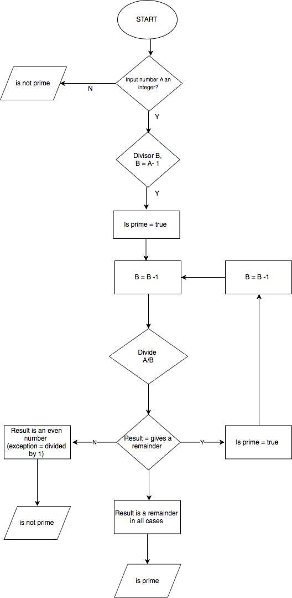

# T1A1 WORKBOOK

#### Q1: Research the development of the internet from 1980 to today. You must describe at least FIVE key events in the development of the internet. You can refer to events, people of significance, or technologies and how they have changed over time.


#### Q2: Define the features of the following technologies that are essential in terms of the development of the internet: packets, IP addresses (IPv4 and IPv6), routers and routing, domains and DNS. Explain how each technology has contributed to the development of the internet. 

Packets: a message is data sent across the Internet.  However before this message can be sent it needs to be first split in many fragments called packets. Network packets are nothing but the information or units of data that a source node (computing device) wants to send/receive to/from the destination node (Nimkarde, 2018). 

These packets are sent independently of each other. The typical maximum packet size is between 1000 and 3000 characters. The Internet Protocol specifies how messages should be packetized (Li, 2017). 

IP addresses: An IP of a computer device is the address of that device in a computer network. Technically speaking, an IP address it is a 32-bit number used to identify devices in a network. This means that all the communication to and from the device in that network will be done in terms of its IP address. 
The early computer scientists wanted to identify computers on the Internet with a unique number, something like a telephone numbers today. So, they came up with the concept of TCP/IP. Nowadays there are two standards of IP addresses:

•	IPv4: IPv4 addresses are 32 bits (four bytes). An example of the IPv4 address would be 104.244.42.129, which is the IPv4 address of twitter. They are stable to use and hence are used today to identify machines in the world. IPv4 addresses are also classified into five classes named Class A, B, C, D, E.
•	IPv6: IPv6 addresses are pretty new and they are basically eight hexadecimal numbers separated by “:”. An example of IPv6 address would be 2001:0cb8:85a3:0000:0000:8a2e:0370:7334. They are unstable and hence not used widely yet. The web is still using IPv4 due to its stability and there is no estimate when we will start to use IPv6 since it is not stable for now (Nimkarde, 2018). 

Routers and Routing: a router is a hardware component that takes care of routing packets. A router’s job is to determine from which node or computing device the packet came from and which destination node the sender node want to send it to, in other words to move packets along from their source to their destination.  A Router does this by identifying the destination node address to which a network packet has to be sent and it forwards it to the desired address  (Nimkarde, 2018).

When a packet moves from one router to the next, it’s called a hop (Li, 2017). Routers have a specific “Routing Protocol” that defines the format in which they exchange data with another router or networking nodes. In other words, routing protocol defines how routers communicate with each other. Routers also build up a “Routing Table” which identifies the most optimized paths to be taken in the network while sending packets (Nimkarde, 2018). If the network containing the IP address is found, the packet is sent to that network. If the network containing the IP address is not found, then the router sends the packet on a default route, usually up the backbone hierarchy to the next router. If the next router does not know where to send the packet, again the packet is routed upwards until it reaches a NSP backbone. The routers connected to the NSP (Network Service Provider) backbones hold the largest routing tables and here the packet will be routed to the correct backbone, where it will begin its journey 'downward' through smaller and smaller networks until it finds it's destination (Shuler, 2002).


Domains and DNS:  In order to access Internet resources by user-friendly domain names rather than these IP addresses, users need a system that translates these domain names to IP addresses and back. This translation is the primary task of an engine called the Domain Name System (DNS) (Chandramouli and Rose, 2013).
According to Nimkarde (2018) a Domain Name Server is a server having huge records of domain name mapping IP addresses which searches for the domain input and returns the respective IP address of the machine on which the website you want to access is hosted. A domain is divided into 3 parts:

1. Protocol: The protocol used to access the website, for example, HTTP, HTTPS, etc.
2.Domain name: The main domain name in our domain. This can be anything that is available as per the ICANN registry.
3.Domain extension: This is one which is considered important while buying a domain. Generally, it is classified into two types:

•Generic Top-level Domains (gTLDs):  includes most popular domain extensions like .com, .org, .net, .edu, .co, etc.
•Country Code Top-level Domains(ccTLDs): These indicate that the domain is related to the country code specified in the domain extension. For example, “in” indicates that the website is originated from India. Also, some of the ccTLDs require that the person purchasing the domain should be from the same country. Most of the small country code extensions are not searchable from outside that country. 


#### Q3: Define the features of the following technologies that are essential in terms of the development of the internet:

TCP: is responsible for routing application protocols to the correct application on the destination computer. Under the application layer in the protocol stack is the TCP layer. When applications open a connection to another computer on the Internet, the messages they send (using a specific application layer protocol) get passed down the stack to the TCP layer. In order to accomplish this, port numbers are used. Ports can be thought of as separate channels on each computer. When a packet arrives at a computer and makes its way up the protocol stack, the TCP layer decides which application receives the packet based on a port number destination (Shuler, 2002). 

TCP is a connection-oriented, reliable, byte stream service, which means that two applications using TCP must first establish a connection before exchanging data. TCP is reliable because for each packet received, an acknowledgement is sent to the sender to confirm the delivery (Shuler, 2002).

HTTP and HTTPS: The application protocol that makes the web work is Hypertext Transfer Protocol or HTTP. HTTP is the protocol that web browsers and web servers use to communicate with each other over the Internet. It is an application level protocol because it sits on top of the TCP layer in the protocol stack and is used by specific applications, in this case web browsers and web servers, to talk to one another. 
Most protocols are connection oriented, meaning the two computers communicating with each other keep the connection open over the Internet. This is not the case of HTTP, which is a connectionless text based protocol. Web browsers send requests to web servers for web elements such as web pages and images. After a server services the request the connection between browser and server across the Internet is disconnected. A new connection must be made for each request (Shuler, 2002)
Web browsers (requests, rendering and developer tools): Web browsers main components are: the user interface, the browser engine, the rendering engine, networking, UI backend, JavaScript interpreter, and Data storage. 
The main function of a browser is to present the web resource you choose, by requesting it from the server and displaying it in the browser window. Typically a browser will request HTML, CSS, JavaScript and image content from a server and interpret them based on the web standard specification (https://www.w3.org/standards). These specifications allow websites to behave the same way across browsers. 
The responsibility of the rendering engine is to display of the requested contents on the browser screen. By default the rendering engine can display HTML and XML documents and images but it can display other types of data via plug-ins or extension; for example, displaying PDF documents using a PDF viewer plug-in. 
Most browser user interfaces have these user interface elements in common: address bar for inserting a URI; back and forward buttons; bookmarking options; refresh and stop buttons for refreshing or stopping the loading of current documents, and a home button that takes you to your home page. (Irish and Garsiel, 2011)
When you type a URL into a web browser if the URL contains a domain name the browser first connects to a domain name server and retrieves the corresponding IP address for the web server. The web browser connects to the web server and sends an HTTP request (via the protocol stack) for the desired web page. The web server receives the request and checks for the desired page. The web browser receives the page back and the connection is closed. The browser then parses through the page and looks for other page elements it needs to complete the web page (e.g. images). For each element needed, the browser makes additional connections and HTTP requests to the server for each element (Shuler, 2002). 
- Developer tools: allow web developers to test and debug their code. They are different from website builders and integrated development environments (IDEs) in that they do not assist in the direct creation of a webpage, rather they are tools used for testing the user interface of a website or web application.

Web development tools come as browser add-ons or built-in features in web browsers. Most popular web browsers, such as Google Chrome, Firefox, Internet Explorer, Safari and Opera, have built-in tools to help web developers, and many additional add-ons can be found in their respective plugin download centers.

Web development tools allow developers to work with a variety of web technologies, including HTML, CSS, the DOM, JavaScript, and other components that are handled by the web browser (Wikipedia, 2019).

#### Q4: Identify THREE data structures used in the Ruby programming language and explain the reasons for using each.

Data structures are specific ways to organize & access data (Castello, 2019). Data structures can hold more than a single value and they organize data to operations on them. This allows keeping the data together to pass it around the program and do different things with it. Generally speaking some common tasks you want to do with data are: add, remove, find, or sort some or all data elements. Depending on the task required, you would need to choose a data structure that makes that task easier, faster, and more efficient (Urie, 2018).

In object-oriented programming, like Ruby, we usually think in terms of objects and how certain objects relate to, or use, other objects. The same goes for data structures but here the “objects” are items (data values) that the structure stores (Urie, 2018). Here are three data structures commonly used in Ruby:

1.	The array: A fixed length, ordered collection of values of the same type stored in contiguous memory locations; the collection may be ordered in several dimensions. Arrays use a contiguous chunk of memory where objects are stored one after another without gaps between them. The values stored in an array are called elements. These elements are accessed by indexing into the array, an integer value is used to indicate the ordinal value of the element (Fox, 2011).
Arrays are important because they allow many values to be stored in a single data structure while providing very fast access to each value. This is made possible by the fact that: (a) all values in an array are the same type, and hence require the same amount of memory to store, and that (b) the elements are stored in contiguous memory locations. 
In general you should use an array: as a base for more advanced data structures, to collect items, when you want immediate access to items and will know their index, have a fairly stable number of items, or know a maximum number beforehand, need to sort and search quickly, won’t need to insert or remove data frequently (Castello, 2019; Urie, 2018).

Arrays in ruby are the “dynamic” type, meaning its capacity can change. Ruby arrays are dynamic arrays that expand automatically whenever a value is stored in a location beyond the current end of the array (Fox, 2011).


2.	A hash: (sometimes known as associative arrays, maps, or dictionaries) are similar to arrays in that they are indexed collection of object references. However, while you index arrays with integers, you can index a hash with objects of any types: strings, regular expressions, and so on. When you store a value in a hash, you actually supply two objects - the index (normally called the key) and the value. You can subsequently retrieve the value by indexing the hash with the same key. The values in a hash can be objects of any type. Compared with arrays, hashes have one significant advantage: they can use any object as an index (Talim, S, 2016). 

Common uses of a hash include: counting characters in a string, mapping words to definitions, names to phone numbers, etc., and to find duplicates inside an array (Castello, 2019)

3. Trees: are data structures that unlike the previous two grow and shrink in length and depth. Trees in ruby just like in real life have a root and then branch and spread out. The tree data structure, though, is often depicted as starting at the top and growing downward — think of roots beneath the ground. Trees have nodes that can contain values as well as references to its children nodes. Tree nodes can have any number of children nodes, though a common number is two. Trees where all nodes have a maximum of two nodes are called binary trees.

Typically, trees are used for data that you want kept sorted and/or has a hierarchy. In binary trees, when kept sorted, the left child node’s value is less than the parent node’s value and the right child node’s value is greater. This way, it is very quick and easy to find a specific value without comparing against all of the possible values.

Trees are great for storing unknown amounts of data that needs to be sorted and searched quickly. If the data will change often and still remain easily searched, trees are a great option. As long as you don’t need instant access to values, and can settle for fast, trees are good. The only real requirement is that you have data than can be sorted. For this reason, trees are not very good for storing data of different types that can’t be compared (Urie, 2018).


####  Q5: Describe the features of interpreters and compilers and how they are different.

A compiler is a computer program that transforms code written in a high-level programming language into the machine code. It is basically a program that translates the human-readable code to a language a computer processor understands (binary 1 and 0 bits). Then the computer processes the machine code to perform the corresponding tasks. 

A compiler should comply with the syntax rule of that programming language in which it is written. However, the compiler is only a program and cannot fix errors found in that program. If a mistake were made, there would need to be changes made in the syntax of the program. Otherwise, it will not compile.

Similarly, interpreters are computer programs that covert each high-level program statement into the machine code, including: source code, pre-compiled code, and scripts. Both compiler and interpreters are in charge of converting higher level programming language to machine code. However a compiler will convert the code into machine code before program run. While, interpreters convert code into machine code when the program is run.

Other differences between compilers and interpreters on the basis of their main features include: 
-Programming Steps: The steps a compiler follow include: creating the program, parse or analyses all of the language statements for its correctness. If no error, convert source code to machine code. Then the compiler links different code files into a runnable program (know as exe) and lastly runs the program. Alternatively the program steps for interpreters involve: creating the program. No linking of files or machine code generation. Lastly, source statements executed line by line during the execution. 
- Machine code: Compilers store machine language as machine code on the disk. Interpreters on the other hand do not save machine code at all.
- Running time: compiled code run faster. Interpreted code runs slower.
- Model: Compilers are based on language translation-linking-loading model. Interpreters are based on Interpretation Method. 
- Program generation: Compilers generates output program (in the form of exe), which can be run independently from the original program. Interpreters do not generate output program. So they evaluate the source program at every time during execution. 
- Program execution: execution is performed only after the entire output program is compiled. Program execution however is a part of Interpretation process, so it is performed line by line. 
- Memory requirement: Target program execute independently and do not require the compiler in the memory. The interpreter exists in the memory during interpretation. 
- Code optimization: The compiler sees the entire code upfront. Hence, they perform lots of optimizations that make code run faster. Interpreters see code line by line, and thus optimizations are not as robust as compilers.
- Speed: process of compilation is relatively complicated, and significant amount of time is required for analyzing and processing the program. Interpreters on the other hand, spend less time analyzing and processing the program. 
- Errors: display all errors after compilation, all at the same time. Interpreters displays error of each line one by one (guru.99, n.d).

#### Q6: Identify TWO commonly used programming languages and explain the benefits and drawbacks of each.

A programming language is a formal language that specifies a set of directions or instructions used to deliver different kinds of computer outputs. The most primitive type of programming language is a machine language or object code. Object code is a set of binary code that is unique to the type of CPU. Each instruction of the object code corresponds to a fundamental operation of the CPU, requiring a significant amount of code instructions. High-level programming languages on the other hand are programming languages that are rather natural for people to write. As we explored earlier it is the compiler’s role to translate the high level language to machine language.

There are thousands of high level computer languages out there, with a couple of hundred among the most popular. According to the 2019 TIOBE index, one of the best lists of popular programming languages, Java and Python are in the top 5 of most popular programming languages (https://www.tiobe.com/tiobe-index/).

- Java: 
The Java programming language was originally developed by Sun Microsystems, which was originated by James Gosling in June 1991. In 1994 it was released under the name of Oak with the original goal to be used in embedded consumer electronic appliances. It promised to be Write Once, Run Anywhere (WORA), providing no- cost run-times on popular platforms. A year later the language was officially renamed to Java and redesigned for developing Internet applications. 

Java is an object-oriented language.  Java is an extension o f the object model, meaning that everything in Java is considered an object. Java is also platform independent. Unlike other programing languages when Java is compiled, it is not 
compiled into platform specific machine code but rather into platform independent byte code. This byte code can be distributed to any system over the web and is then interpreted by the Java Virtual Machine (JVM) on whichever platform it is being run. Java is designed to be easy to learn, which is probably why it is considered the perfect language for the developers and programmers to learn. Java is also secure. It allows for the development of virus-free, tamper- 
free systems and has authentication techniques based on public-key encryption. Java is architectural-neural, which means that the Java compiler generates an architecture-neutral object file format that makes the compiled code executable on many processors, with the presence of a Java runtime system. Being architectural-neutral and having no implementation dependent aspects makes Java portable. Java makes an effort to eliminate error prone situations by emphasizing mainly on compile time error checking and runtime checking, which makes it a robust programming language. 
Java is multithreaded, making it possible to write programs that can do many tasks simultaneously. This design feature allows developers to construct smoothly running interactive applications. Java byte code is translated to native machine instructions and is not stored anywhere. The development process is more rapid and analytical since the linking is an increment and lightweight process. With the use of Just-In-Time compilers, Java enables high performance. Java is designed for the distributed environment of the Internet. 
Lastly, Java is dynamic and designed to adapt 
to an evolving environment (Humer and Foster, 2014). 

 
Some advantages of Java include: It was designed to be straightforward to use ,write, compile ,debug than alternative language. Creates standard program and reusable code. It has ability to move simply from one automatic data. Allows processing system to another (Naveen Reddy, Geyavalli, Sujani, and Rajesh, 2018).

Some of the disadvantages of Java include: considerably additional memory consumption than C or C++. The default look and feel of GUI applications. Single paradigm languages (Naveen Reddy, Geyavalli, Sujani, and Rajesh, 2018).

-	Python 
The Python programming language was originally developed by Guido van Rossum in the late 1980s and early 1990s at the National Research Institute for Mathematics and Computer Science in the Netherlands. Python is derived from other languages, including ABC, Modula-3, C, C++, Algol-68, SmallTalk, Unix shell, and other scripting languages. 

Python is currently one of the most popular dynamic programming languages. Although it is often viewed as a scripting language, it is really a general purpose programming language. It is a style philosophy that emphasizes code readability, notable using significant white space. Python constructs clear programming on both small and enormous scales. Python is an object oriented scripting language the run time speed of this language is 71.90secs and the memory utilized is 2.80mb/sec (Naveen Reddy, Geyavalli, Sujani, and Rajesh, 2018).

Some of Python’s main features include. Python is easy-to-learn in that it has relatively few keywords, a simple structure, and a clearly 
defined syntax. Python is also known to be easy-to-read. Python code is much more clearly defined and visible to the eyes. Python’s success is also perhaps linked to the fact that its source code is fairly easy-to-maintain. One of Python’s greatest strengths is the bulk of the library is 
very portable and cross-platform compatible on Unix, Windows and Macintosh. Python also supports for interactive mode in which you can enter results from 
a terminal right to the language, allowing interactive testing and debugging of snippets 
of code. Python is portable and it can run on a wide variety of hardware platforms and has the same 
interface on all platforms. Python is extendable allowing you to add low-level modules to the Python interpreter, making developer tools more efficient. Python supports GUI applications that can be created and ported to 
many system calls, libraries and windows systems, such as Windows MFC, Macintosh 
and the X Window system of Unix. Last but not least Python is scalable and provides a better structure and support for large programs than shell 
scripting (Humer and Foster, 2014). 


Some advantages of Python include: Extensive libraries. Improved productivity. Free and open source. 

Some of its disadvantages include: Speed limitations. Undeveloped data base access layer. Design restrictions (Naveen Reddy, Geyavalli, Sujani, and Rajesh (2018).

#### Q7: Identify TWO ethical issues from the areas below and discuss the extent to which an IT professional is ethically responsible in terms of the issue.
#### List of topics containing ethical issues:
  #### - access to a user’s personal information (medical, family, financial, personal attributes such as ## sexuality, religion, or beliefs)
  #### - intellectual property, copyright, and acknowledgement.
  #### - criminal acts such as theft, fraud, trafficking and distribution of prohibited substances, terrorism
  #### - GPS tracking data and other types of metadata, MAC addresses, hardware fingerprints
  #### - freedom of thought, conscience, speech and the media
  #### - aggressive sales and marketing practices designed to mislead and deceive consumers
  ####  - trading of shares on the stock exchange OR crypto-currencies

For each ethical issue identify a source of legal information relating to the ethical issue and discuss whether the law is helpful in assisting a developer to act in an ethical way.

Conduct research into a case study of ONE of the ethical issues you have chosen discuss how an ethical IT professional should respond to the case study and how they might mitigate or prevent ethical breaches.

An ethical decision is one made based on reflection about the things we think are important and that is consistent with those beliefs. Instead, the law tries to create a basic, enforceable standard of behavior necessary in order for a community to succeed and in which all people are treated equally (The Ethics Centre, 2016). Let’s examine two situations and explore what ethical and legal issues apply to them 

1.	Access to a user’s personal information (medical, family, financial, personal attributes such as sexuality, religion, or beliefs)

There are two ethical issues that apply to this particular example. The first one pertains to the issue of Privacy. Privacy is an individual condition of life characterized by exclusion from publicity (Neetling et al., 1996, p. 36). Privacy is an important human right because it is a necessary condition for other rights such as freedom and personal autonomy. In this sense, respecting a person's privacy is to acknowledge such a person's right to freedom and to recognize that individual as an autonomous human being (Britz, n. d).

According to the ACM Code of Ethics and Professional Conduct computing professionals should respect privacy of the users and only use personal information for legitimate ends and without violating the rights of individuals and groups. This requires taking precautions to prevent re-identification of anonymized data or unauthorized data collection, ensuring the accuracy of data, understanding the provenance of the data, and protecting it from unauthorized access and accidental disclosure. It also emphasizes that computing professionals should establish transparent policies and procedures that allow individuals to understand what data is being collected, used, and to give informed consent for automatic data collection, and understand how their data would be retained or disposed. The code of ethics also clearly states that personal information gathered for a specific purpose should not be used for other purposes without the person's consent (ACM, 2018)

The second ethical issue pertaining to this example is the issue of confidentiality. According to the ACM Code of Ethics, since computing professionals are often entrusted with confidential information they should protect confidentiality except in cases where it is evidence of the violation of law, of organizational regulations, or of the Code. In these cases, the nature or contents of that information should not be disclosed except to appropriate authorities (ACM, 2018).

2.	Intellectual property, copyright, and acknowledgement.

The ACM (2018) advises that computing professionals should respect the work required to produce new ideas, inventions, creative works, and computing artifacts. It acknowledges that developing new ideas, inventions, creative works, and computing artifacts creates value for society, and those who expend this effort should expect to gain value from their work. Computing professionals should always credit the creators of ideas, inventions, work, and artifacts, and respect copyrights, patents, trade secrets, license agreements, and other methods of protecting authors' works.

However the law recognizes that some exceptions to a creator's control of a work are necessary for the public good. Computing professionals should not overly oppose reasonable uses of their intellectual works, after all free and open source software and work put into the public domain have made and continue to make major contributions to society. In this particular context is important that computing professionals should not claim private ownership of work that they or others have shared as public resources.

•	Case Study: 


#### Q8: Explain control flow, using an example from the Ruby programming language

A control flow construct is a language feature, which disrupts the normal progression to the next statement, and conditionally or unconditionally branches to another location in source code. –– Robert Klemme (retrieved from https://learn.co/lessons/conditional-readme).

Conditionals 
are the most common control structure and the most the basic forms include: If, else, and elsif statements, case statements, and loops. Let’s look at while loops. The control flow enters the while loop at the instruction while. This statement determines whether the control enters the body of the loop. If the conditional evaluates to true, then the statements in the loop are executed. In this case the control flow will continue through all the statements specified. Once a statement has finished executing the control flow jumps back to the first instruction (while) and the whole process starts again. If the condition evaluates false then the control flow goes to the instruction, end, and the loop is exited.

Let’s see the following example of control flow with a while loop: 
n = 5
i = 0
while (i <= 0)
	puts i
	i = i + 1
end

This code is a simple program that prints every number between 0 and 5. The loop repeats and prints the value in i and then increments the value by 1. The loop continues as long and while the value of i is less than or equal than the value of n = 5. In this case the variable i will be incremented to after 6 iterations i will be larger than n (Freider, Freider, Grossman, 2013). 


#### Q9: Explain type coercion

In computer science there are different ways of, implicitly or explicitly, changing an entity of one data type into another. One of them is known as type coercion. 

Type coercion is defined as the automatic or implicit conversion of a datum from one data type to another within an expression. Coercion occurs because the datum is stored as one data type but its context requires a different data type (retrieved from https://developer.mozilla.org/en-US/docs/Glossary/Type_coercion)

Type conversion is similar to type coercion because they both convert values from one data type to another with one key difference that type coercion is implicit whereas type conversion can be either implicit or explicit. 

McFarlin (2014) thinks of type coercion as how an interpreter or compiler works to determine what kind of comparison is being made, whereas conversion is an explicit change in type that the programmer writes in the code.

One type is always coerced into another and there's normally a hierarchy for how it occurs. Though each language is different, note that in the second example when we are concatenating a string and a number, the result is a string. This is because the number is coerced into a string (McFarlin, 2014).


#### Q10: Describe the data types recognised by the Ruby programming language. In your description you should give example code which uses each data type, and include the name of the Ruby classes which represent each data type.

According to Flanagan and Matsumoto (2008) in order to understand a programming language, you have to know what kinds of data it can manipulate and what it can do with that data. Data types tell the computer how to handle the data in your program. They also determine what you can do with the data, including which operations you can perform (Hogan, 2017).

In the Ruby programming language the types of data that can be manipulated include: numbers, text (represented by the string class), arrays, hashes, and ranges, symbols or labels, objects. As we described earlier arrays and hashes allow us to work with collections of data and in a way they are containers of data, therefore they are often considered data structures (Flanagan and Matsumoto, 2008).

Code: 

```
# explicitly assigning vales to variables 
    a = 3
    b = 3.0
    c = "Hello World"
    d = :bye 
    e = 0..10
    f = { }
    g = [ ]

# printing class of the variables
    puts "#{a} : #{a.class}"
    puts "#{b} : #{b.class}"
    puts "#{c} : #{c.class}"
    puts "#{d} : #{d.class}"
    puts "#{e} : #{e.class}"
    puts "#{f} : #{f.class}"
    puts "#{g} : #{g.class}"
 ```

#### Q11: Here’s the problem: “There is a restaurant serving a variety of food. The customers want to be able to buy food of their choice. All the staff just quit, how can you build an app to replace them?”>
  #### Identify the classes you would use to solve the problem
  #### Write a short explanation of why you would use the classes you have identified

  To solve the problem above I would create an app with the following features: 

- A link and information about the app will be found in the restaurant’s website if they have one or it will be placed at the restaurants counter and tables in a flyer. In the flyer the user should expect to find information about the app, how to download it, and pick up/take away or pick up/eat in only options available.
- Class Menu: Display menu of the restaurant with all food options available by categories: snacks, lunch, dinner, desert, drinks, etc. There could be different menus in this class.  
- Class Order: The user would be able to select the items or food they want and add them to their cart. There could be multiple orders in this class allowing for groups ordering different things.
- Class Payment: When the user has finished ordering they will be prompted to go to the payment section and add their payment/card details. There could be different payment options including splitting bill.
- The user is provided with a receipt and assigned an order number that they will need to use to pick up the food at the counter. 
- The user is able to track the progress of the order in the app, via a progress bar feature.  
- The user receives a notification when the order is ready for pick up and their order number and name will be displayed on a screen near the pick up counter.

These classes were created with the intention of replacing the waiters and other customer service staff. This app is built on the assumption that the restaurant would act as a take away/self-serve restaurant type and that it would have the minimum required number of people needed to operate the business.  

#### Q12: Identify and explain the error in the following code that is preventing correct execution of the program

``` 
celsius = gets 
fahrenheit = (celsius * 9 / 5) + 32 
print "The result is: " 
print fahrenheit 
puts "." 
``` 

fixed code: 

``` 
puts "The temperature in celsius is:"
celsius = gets.chomp.to_i
fahrenheit = (celsius * 9 / 5) + 32 
print "The result in fahrenheit is: #{fahrenheit}" 
puts "." 
``` 

The code above first returned nothing, and then a no method error. This could be possibly explained by: 1) the fact that variable Celsius was set to be assigned by user input, however the user was not prompted for input in the code; and 2) the errors in lines two and three. The second line only prints the first part of the output “the result is”, and the third line although is asking to print the value of the variable we want is failing to do so because it does not use string interpolation. String interpolation allows to ‘call out’ the method defined to assign the value of the variable Fahrenheit. 

#### Q13: The following code looks for the first two elements that are out of order and swaps them; however, it is not producing the correct results. Rewrite the code so that it works correctly.

```
arr = [5, 22, 29, 39, 19, 51, 78, 96, 84]
i = 0
while (i < arr.size - 1 and arr[i] < arr[i + 1])
  i = i + 1 end
puts i
arr[i] = arr[i + 1]
arr[i + 1] = arr[i]
``` 

Fixed code:
```
arr = [5, 22, 29, 39, 19, 51, 78, 96, 84]
i = 0

 while (i < arr.size - 1 and arr[i] < arr[i + 1]) 
     i = i + 1
     if (i < arr.size - 1 and arr[i] > arr[i + 1])
         x = arr[i]
         arr[i] = arr[i + 1]
         arr[i + 1] = x 
         i = 0
     end
 end

puts arr
```

#### Q14: Demonstrate your algorithmic thinking through completing the following two tasks, in order:
  #### i. Create a flowchart to outline the steps for listing all prime numbers between 1 and 100 (inclusive). Your flowchart should make use of standard conventions for flowcharts to indicate processes, tasks, actions, or operations  
  #### ii. Write pseudocode for the process outlined in your flowchart

i. Flowchart: 


ii. Pseudocode 

-# A is assinged a number between 1 && 100. 
-# B is the divisor and is set to be A- 1. 
-# We assume is prime at the begining of the method.
-# We create a while loop with the condition that B != 1 divides the A/B.
-# While B !=1 is true A divided by B. If it does not divive evenly by any other numbers other than 1 and itself. In this case is not equal to 0, so is prime is now false and it keeps looping until it finds a division that is not 0.
-# While A/B give a remainder the loop continues and B becomes B-1 each time before the loop starts again. 
-# If A/B divides evenly by at least one number other than 1 and itself then is prime is false and it goes to the second if condition. It prints "is not prime" and the loop ends. 
-# if A/B never divides evenly by any other number other than itself and 1, it prints "is prime" and it ends.

#### Q15: Write pseudocode OR Ruby code for the following problem:
#### You have access to two variables: raining (boolean) and temperature (integer). If it’s raining and the temperature is less than 15 degrees, print to the screen “It’s wet and cold”, if it is less than 15 but not raining print “It’s not raining but cold”. If it’s greater than or equal to 15 but not raining print “It’s warm but not raining”, and otherwise tell them “It’s warm and raining”.

```
raining = [ "yes", "no" ] 
temperature_celsius = 0...100 

puts "Hey there, is it raining right now?"
raining= gets.chomp.to_s

puts "what is the temperature in celsius right now?"
temperature_celsius = gets.chomp.to_i

if raining == "yes" && temperature_celsius < 15 
    print "It’s wet and cold" 
elsif raining == "no" && temperature_celsius < 15
    print "It’s not raining but cold"
elsif raining == "no" && temperature_celsius >= 15 
    print "It’s warm but not raining"
else 
    print "It’s warm and raining"
end
```

#### Q16: An allergy test produces a single numeric score which contains the information about all the allergies the person has (that they were tested for). The list of items (and their value) that were tested are:
 #### - eggs (1)
 #### - peanuts (2)
 #### - shellfish (4)
 #### - strawberries (8)
 #### - tomatoes (16)
 #### - chocolate (32)
 #### - pollen (64)
 #### - cats (128)
#### So if Tom is allergic to peanuts and chocolate, he gets a score of 34.

#### Write a program that, given a person’s score can tell them:
#### a. whether or not they’re allergic to a given item
#### b. the full list of allergies.
